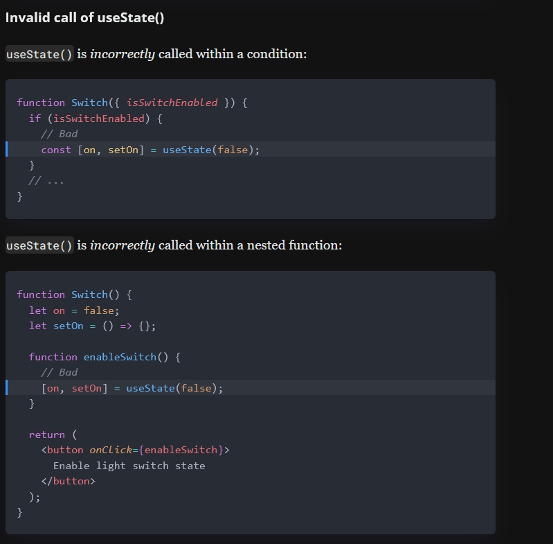

### Dictionary of Contents

1. Intro To Folder Structure - Line 4
2. Intro To Components - Line 22
3. Props - Line 50
4. States - Line 78

---

---

### 1. INTRO TO FOLDER STRUCTURE

---

---

### Folder Structure:

1. src
   1.1 inside src we have couple folders:
   1.1.1 components folder:
   1.1.1.1 Home.jsx
   1.1.1.2 About.jsx
   1.1.1.3 Contact.jsx
   1.1.2 scss folder:
   1.1.2.1 global.scss
   1.1.2.2 \_variables.scss
   1.1.2.3 \_mixins.scss
   1.1.2.4 \_functions.scss
   1.1.2.5 \_reset.scss
   1.1.2.6 \_typography.scss
   1.1.2.7 \_animations.scss
   1.1.2.8 \_media-queries.scss
   1.1.3 App.jsx
   1.1.4 index.jsx
2. public
   2.1 inside public we have some files:
   2.1.1 index.html - In this file we have the main div that will be the root of our application.
   2.1.2 favicon.ico
   2.1.3 logo.png
   2.1.5 manifest.json
3. package.json
4. README.md
5. package-lock.json

---

---

### 2. INTRO TO COMPONENTS

---

---

1.  There are two types (Class components and Functional components)
    1.1 Class components:
    1.1.1 It takes props and gives back HTML (JSX)
    1.1.2 It has lifecycle methods
    1.1.3 It has state (some information that is private for that specific component)
    Code example: components -> componentsExample -> classComponent.jsx

        1.1.4 Then in a new file like App.js we can use it like this:
        import Welcome from './Welcome'

        function App(){
            return <Welcome name="John" />
        }

    1.2 Functional components:
    1.2.1 It takes props and gives back HTML (JSX)
    1.2.2 It has no state
    1.2.3 It has no lifecycle methods
    1.2.4 Always import React from 'react'
    Code example: components -> componentsExample -> functionalComponent.jsx

        1.2.5 Then in a new file like App.js we can use it like this:
        import Greet from './Greet'

        function App(){
            return <Greet />
        }

    1.3 When to use particular component:
    Functional: - Used for simple functions that output UI elements.
    Example: A function that returns a simple greeting message. - Does not use the 'this' keyword, making the syntax simpler.
    Example: const Greet = () => <h1>Hello, World!</h1>; - Does not manage state, suitable for static display components.
    Example: const Clock = () => 
{new Date().toLocaleTimeString()}
; - Primarily focused on rendering UI, not on handling data or logic.
    Example: const Button = () => <button>Click me</button>;

        Class:
            - Suitable for more complex functions that involve significant logic.
              Example: A class that fetches data and processes it before rendering.
            - Can maintain its own private data, known as state.
              Example: class Counter extends Component { state = { count: 0 }; increment = () => { this.setState({ count: this.state.count + 1 }); }; render() { return <button onClick={this.increment}>{this.state.count}</button>; } }
            - Handles complex UI logic, possibly involving multiple sub-components and interactions.
              Example: class Form extends Component { state = { username: '' }; handleInput = (e) => { this.setState({ username: e.target.value }); }; render() { return <input type="text" value={this.state.username} onChange={this.handleInput} />; } }
            - Provides lifecycle methods for more control over the component's behavior from creation to destruction.
              Example: class User extends Component { componentDidMount() { console.log('Component did mount!'); } componentWillUnmount() { console.log('Component will unmount!'); } render() { return 
User component
; } }

---

---

### 3. PROPS

---

---

1.  Props in React are used to pass data and event handlers down to child components from a parent component.
2.  It's a mechanism for components to communicate with each other.
3.  Props are read-only, which means that a component can only read the props given to it, never modify them.
4.  The data a component receives through props is accessible in the component function as the first parameter.
5.  Props value can't be changed

6.  Example of a functional component receiving props:
    Code Example: components -> props -> functionalProps.jsx

    And in the parent component we can use it like this:
    <WelcomeMessage name="John" />

7.  How to use children props with Functional Components:
    Code Example: components -> props -> childrenProps.jsx

    In the file app.js, use the ParentComponent and pass children:

    <ParentComponent name="John">
        <h2>Child component content</h2>
    </ParentComponent>

    Output of app.js:
    

    <h1>Hello John Component</h1>
    <h2>Child component content</h2>
    

8.  How to use children props with Class Components:
    Code example: components -> props -> childrenClassProps.jsx

    In the file app.js, use the ParentComponent and pass children:
    import ParentComponent from './ParentComponent'

        <ParentComponent>
            name = 'Katherine'
            <button>Click me</button>
        </ParentComponent>

    Output of app.js:
    

    <h1>Hello Katherine Component</h1>
    <button>Click me</button>
    

---

---

### 4. STATES

---

---

1.  State introduction:
    CLASS COMPONENT
    Code example: components -> states -> state.jsx

         FILE - App.js

        import React, { Component } from 'react'
        import Message from './Message'

         class App extends Component {
            render(){
                

                    <Message />
                

            }
         }

         OUTPUT: Welcome visitor AFTER CLICK SUBSCRIBE BUTTON: Thank you for subscribing

2.  setState:
    CLASS COMPONENT
    Code example: components -> states -> setState.jsx

         FILE - App.js

         import React, { Component } from 'react'
         import Counter from './Counter'

         class App extends Component {
            render(){
                

                    <Counter />
                

            }
         }

         OUTPUT: After Clicking it will increment by 1

---

---

### 5. HOOKS

---

---

1.  useState() Hook:
    Code example: components -> hooks -> useState.jsx
    To enable state management for functional components, you need useState() hook.

        1.1 State management using useState():
        Adding state to a functional component requires 4 steps: enabling the state, initializing, reading, and updating.
        1.1.1 Enabling the state: Line 1: Importing the useState hook from React.
        1.1.2 Initializing: Line 4: Initializing the state variable 'on' with a default value of false.
        1.1.3 Reading: Line 10: Reading the state variable 'on' to determine the class of the div element.
        1.1.4 Updating: Line 5 - Line 6: Updating the state variable 'on' using the setOn function.
        1.1.5 There is also a possibility to have less code do it like this: Line 19 - Line 35.

        1.2 Multiple States:
        1.2.1 Make sure that multiple calls of useState() are always in the same order between renders.

        1.3 Lazy initialization of state:
        1.3.1 When the initial state requires expensive performance-wise operation, use the lazy initialization of state by supplying a function as an argument to useState(computeInitialState):
        function MyComponent({ bigJsonData }) {
        const [value, setValue] = useState(function getInitialState() {
        const object = JSON.parse(bigJsonData); // expensive operation
        return object.initialValue;
        });
        // ...
        }
        !!!getInitialState() is executed just once, at the initial render, to get the initial state.!!!
        !!!On later renderings of the component, getInitialState() is not invoked, skipping the expensive operation.!!!

        1.4 PitFalls:
        1.4.1 Where to use StateHook(): -
        1.4.1.1 Only Call Hooks from React Functions
        1.4.1.2 Only Call Hooks at the Top Level!
        DONT USE HOOKS LIKE THIS: 

        1.5 Using Reducer:
        Use Reducer when you need multiple lines of useState() hook in other words useReducer() for complex situations
        Code example: components -> hooks -> useReducer.jsx

2.  React.useEffect() Hook:
    Code example: components -> hooks -> useEffect.jsx

    useEffect() — the hook that manages side-effects in functional React components.

    2.1 Side-Effects
    2.1.1

    2.2 useEffect() arguments
    2.3 Component lifecycle
    2.4 Side-Effect Cleanup
    2.5 useEffect() in practice

---

---

### 6. MAP

    When to use map - When we have a lot of data we want to display.
    Map gives the results of the array.
    Using maps we can get an error that each child needs to have a unique "key" prop. - to get rid of this assign a key example 3rd example in src -> components -> loop -> loop.jsx
    KEY ALWAYS HAVE TO BE AT THE TOP LEVEL OF COMPONENT WHENEVER WE ARE DISPLAYING IT.

    There are 3 ways of looping: All of the ways are listed from top to bottom in the code example: src -> components -> loop -> loop.jsx
    1. Having only the name
    2. Having the name and age and using destructuring
    3. Importing from a different file -> employee.jsx

---

---

    Code example: components -> map -> map.jsx

---

---

### 7. ROUTES

---

---

    Code example: components -> routes -> reactRouter.jsx

---

---

### 8. CONDITIONAL RENDERING

    Used to hide or show details in HTML.

    1. if/else - HARDEST TO DO
    Code example: components -> conditionalRendering -> if/else.jsx

    2. Element variables - SIMPLER THAN THE FIRST ONE
    Code example: components -> conditionalRendering -> elementVariables.jsx

    3.Ternary conditional rendering - USED MOST OF THE TIME
    Code example: components -> conditionalRendering -> ternary.jsx

    4.Short circuit operator - USED FOR SPECIFFIC CASES
    Code example: components -> conditionalRendering -> shortCircuit.jsx

### 9. Destructuring props and state

    Destructor is used to make props and state into distinct variables

    1. Destructuring functional component (2 ways):
        1.1 In the parameter: code example -> Line: 17
        1.2 In the body: code example -> Line: 31
    Code example: components -> Destructuring -> destructorFunctional.jsx

    2. Destructuring class component: code example -> Line: 1
    Code example: components -> Destructuring -> destructorClass.jsx
